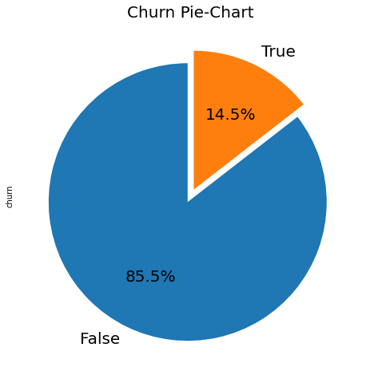
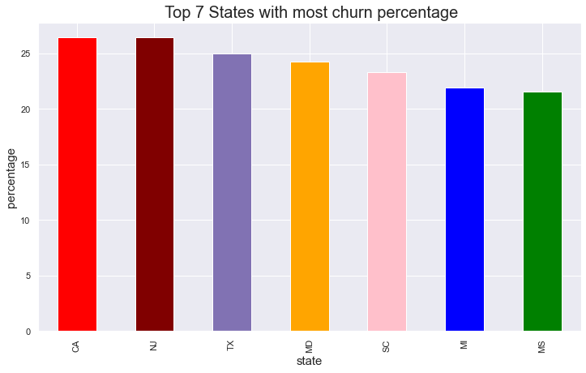
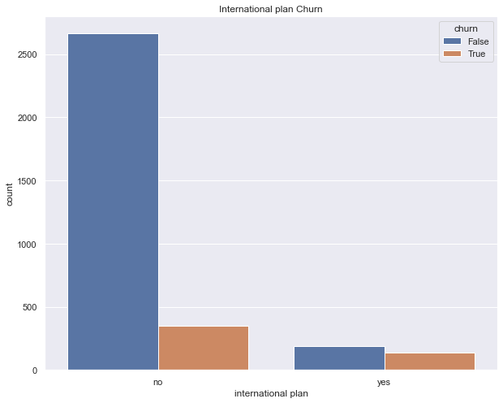
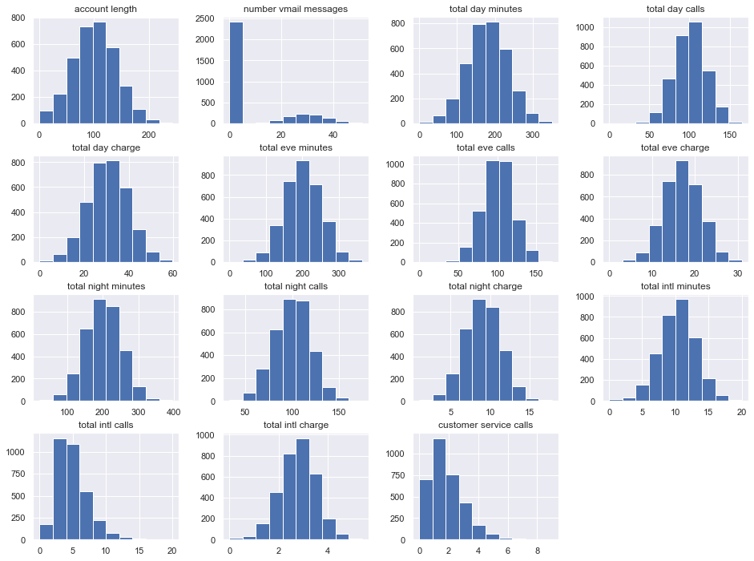
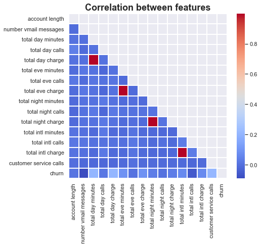
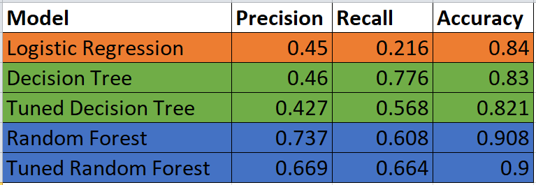

# SYRIATEL CUSTOMER CHURN.
Auther: Leonard Rotich

## Project overview

Churn is a major problem for SyriaTel Company, as it can result in lost revenue and reduced profitability. In this project, I aim to develop a machine learning algorithms to build a model to predict and identify customers who are at risk of churning, and provide recommendations to reduce churn rates. In this project, I am going to use SytiaTel Customer Churn dataset which can be found [here](https://www.kaggle.com/becksddf/churn-in-telecoms-dataset). 
You can find the note book [here](https://github.com/Leon380/Phase3_Project/blob/main/notebook.ipynb).

## Business Problem:

Customer churn is a big problem in any industry and one of the most important concerns for the Telecom industry. The effect on the revenues of the companies, because of this customer churns is huge, especially in the telecom field, that's why these companies are seeking to develop a predictive potential customer churn. In this highly competitive market, the telecommunications industry experiences an average of 15-25% annual churn rate, and it costs 5-10 times more to acquire a new customer than to retain an existing one, that's why customer retention has now become even more important than customer acquisition.

## Data Understanding:

The dataset has 3333 rows (customers) and with 21 columns. Churn column is the target variable which has 483 customers who are churners and the remaining 2850 are non-churners. Since the target variable is a categorical variable, classification algorithms are used to build the predictive model. Recall is used to evaluate the model's performance.

## Exploratory data analysis
There is a class imbalance problem since the target class has an uneven distribution of observations. 85.5% of the data belongs to the False class while 14.5% belongs to the true class.

Among the 7 top states with churners, CA state has a higher rate of churn with a percentage rate of 26.47%.

For interantional plan, 323 customers had subscribe to international plan which is 9.7%  and 3010 had not which is 90.3%. Out of 3010 customers who had not subscribe for international plan 346 (11.49%) turn to be churners which is quit a high number. For the customers who subscribed for international plan out of 323, 137 customers (42.4%) are churners. This means that most international customers ended up leaving the company.

The scaling differs across the features, and a few of the features are not normally distributed. The features will therefore have to be scaled and normalized.

There is a very low correlation between most features.However, there is a perfect positive correlation between total charge and total minutes at different times. This is expected since the charge of a call depends on the length of the call in minutes. 
Total day minutes, total day charge and customer service calls have a weak positive correlation with churn. The other features have a negligible correlation with churn, approximately 0.

## Data preparation for Machine Learning
- Multicollinearity of features: columns showing total charge at different times are dropped to address the multicollinearity 
- Train-test split: Data is split into train and test sets. 
- Transform categorical variables: dummy variables are created for categorical features. 
- SMOTE: SMOTE is used to handle class imbalance problems by oversampling the minority class with replacement. 

## Modeling
Various models are created using logistic regression, decision tree and random forest algorithms. Hyperparameter tuning is applied to ldecision tree and random forest algorithms. 
A pipeline is used to prevent data leakage. Data is scaled in the pipeline. 
The image below shows a summary of the models and their performance.

## Conclusions and recommendations

The final model that will be used to predict customer churn is the random forest with tuned hyperparameters.This model results in the lowest number of false negatives. 
The most important features for predicting customer churn are:
- total day minutes: total number of minutes the customer has been in calls during the day
- total evening minutes: total number of minutes the customer has been in calls during the evening
- customer service calls: number of calls the customer has made to customer service
- total international minutes: total number of minutes the user has been in international calls
 
Syriatel should ensure effective customer service so as to meet customers' expectations and analyze customer interactions. They can then follow up on both positive and negative feedbacks received. 
The more the number of minutes the customer spends on the phone, the higher the likelihood of not churning.  The company should look into the call charge rates in comparison to the competitors, and  consider if they should lower the charges of calls per minute. This can prevent other customers from churning.